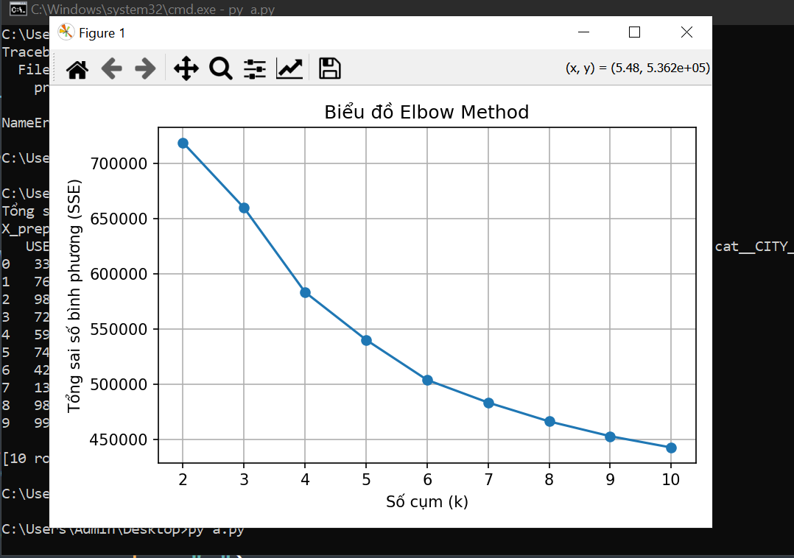
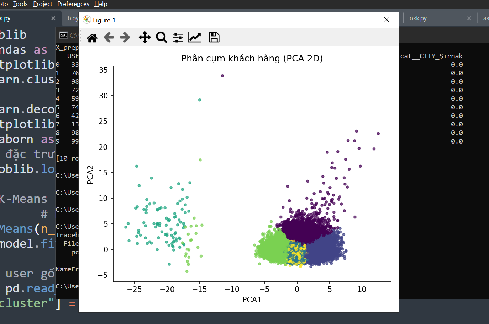
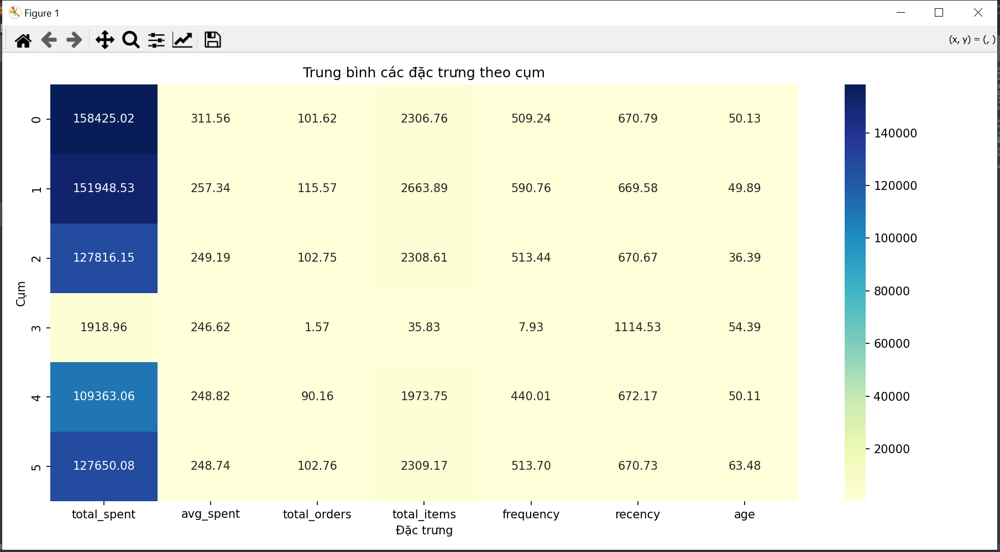
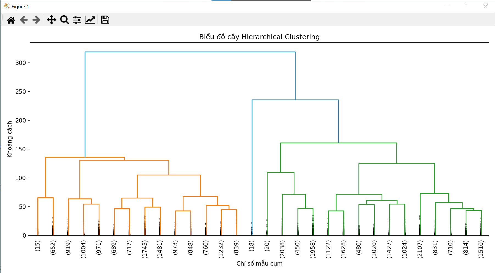
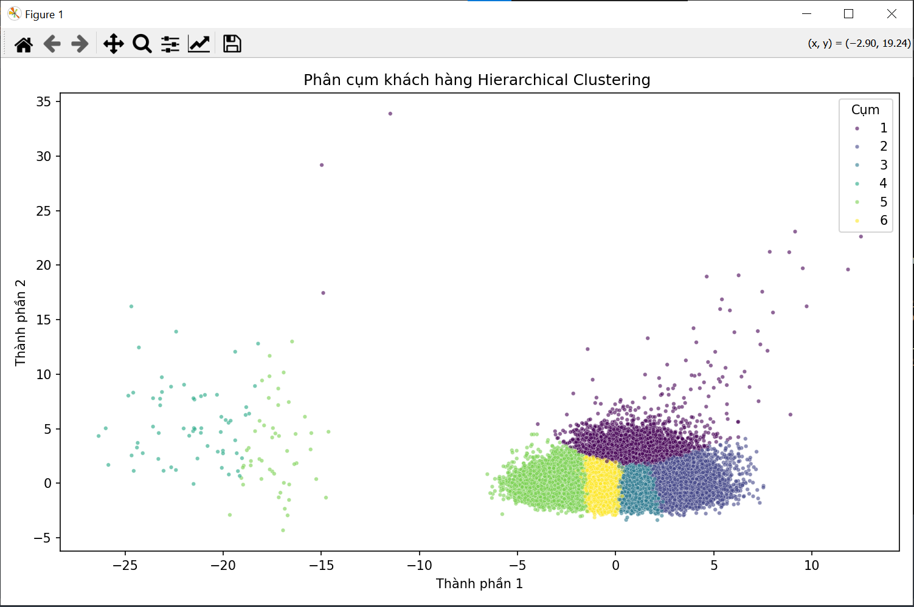
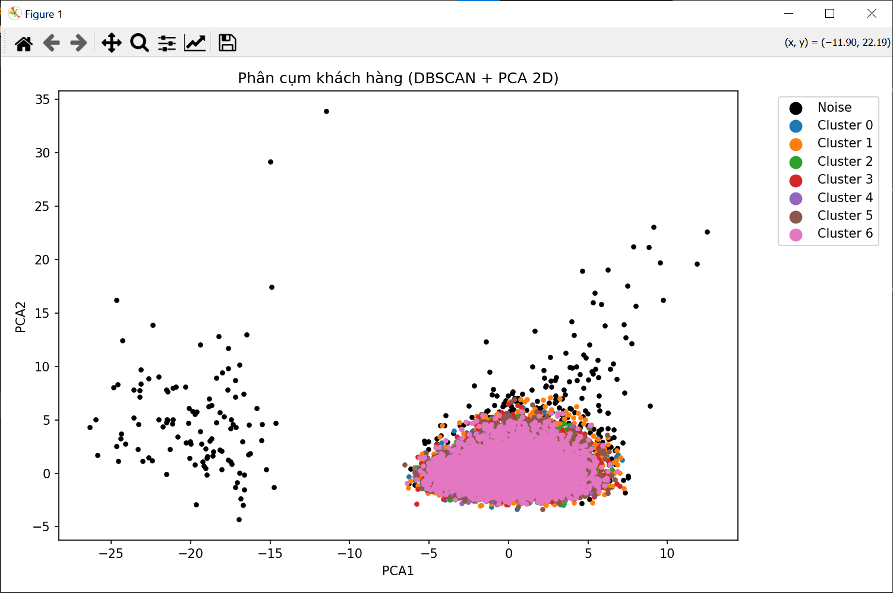
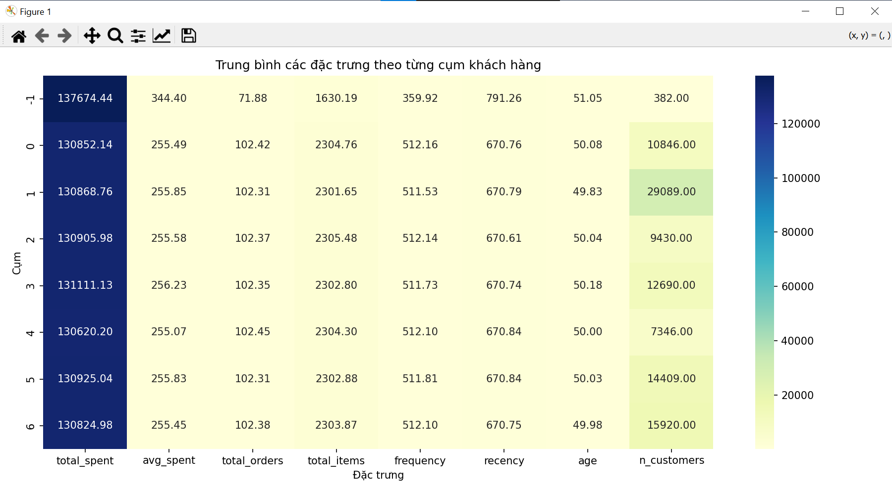

# Applying Machine Learning in Customer Segmentation

This project applies machine learning algorithms to customer segmentation analysis.

## Features
- Data preprocessing
- Customer clustering
- Data visualization
- Machine learning models for segmentation

## Technologies
- Python
- Pandas
- Scikit-learn
- Matplotlib

## Dataset Used
https://www.kaggle.com/datasets/omercolakoglu/50million-rows-turkish-market-sales-datasetmssql

## Usage

1. Import the database into SQL Server.

2. Update the SQL Server connection in `preprocessing.py`:

```python
engine = create_engine(
    "mssql+pyodbc://YOUR_SERVER_NAME/SALES50M"
    "?driver=ODBC+Driver+17+for+SQL+Server&trusted_connection=yes"
)
```

3. Open CMD and navigate to the source code directory.

4. Run the files in the following order:
```bash
py preprocessing.py
py transform.py
py k-means.py
py HIERARCHICAL.py
py DBSCAN.py
```

6. View the output and clustering results for each method.

## Result
https://drive.google.com/drive/folders/1yf0c1UaktT_ULdnJqWEcbyAtiPn0IbvC?usp=sharing








## Author
GitHub106
